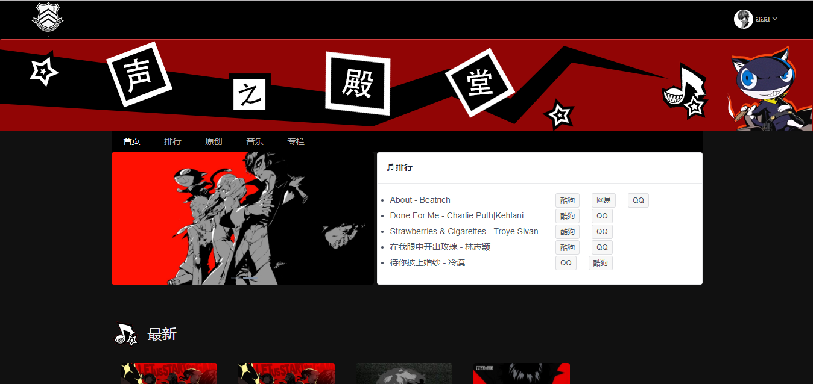
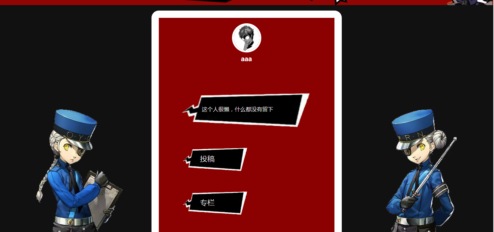
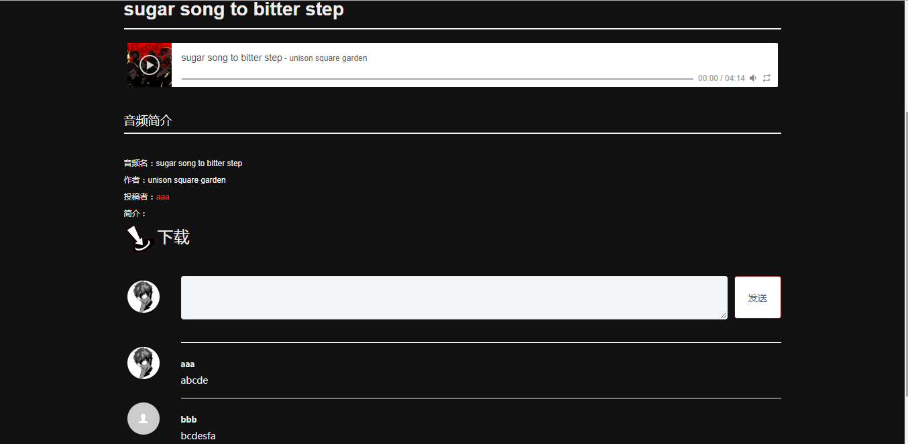

# 音乐分享网站的设计与实现  

## 目的  
之前音乐管理系统的再开发。从python简陋的GUI界面，到使用Django + Bootstrap的web页面，再到现在实现的可上传下载原创或搬运音频，编写专栏，自己将UI设计成女神异闻录5的风格（可能全年级只有我会这么干吧。。。:pill:），另加入爬虫模块对不同音乐网站抓取日排行榜。毕业设计对之前的课程设计来个野猪大改造，自己看起来也很有成就感。  
另，Nginx服务器的配置及后端处理代码在：[https://github.com/MarpleJane/upload-server](https://github.com/MarpleJane/upload-server)  
  
## 开发工具
- 后端：Python3 + Tornado  
  
- 前端：Vuejs + iView
  
- 数据库：MySql + Sqlalchemy
  
- 上传下载服务器：Nginx + Tornado
  
- 其他：APlayerjs（音频播放）、Quilljs（富文本编辑器）
  
## 介绍
- 前台：可上传、下载、播放音频，编辑专栏。上传的音频需审核通过才能显示。用户账号若被禁用则无法登陆。
  
- 后台：上传前台使用的走马灯图片，并设置图片对应的内容。审核音频，及对用户账号的管理。
  
#### 安装依赖  
> pip3 install -r requirements.txt  
#### 启动  
> py -3 start.py  
### 前台  
> /musicweb/index
### 后台  
> /butler/login

## 效果截图  
1. **首页**  
  
  

1. **用户页面**  
   导航设计成手机短信的形式

  

1. **歌曲页面**

  

1. **专栏页面**  
   将编辑的内容上传至树莓派，在树莓派中存储成html文件，在浏览器中使用iframe获取html来显示
